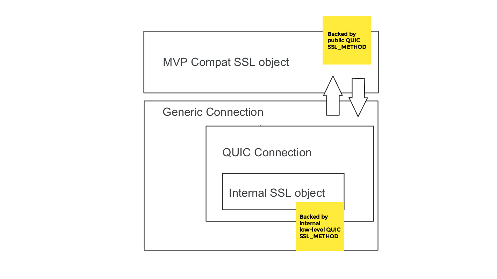

# Design Problem: QUIC API

There are a number of possibilities for how the long term QUIC API could be
structured.

The MVP will be written to allow current applications to use QUIC as a single
stream at “a flip of a switch”.  Just enough of the chosen longer term
design option is expected to be implemented _internally_ to support what the
MVP needs (i.e. not necessarily published as a public API).


## Candidate Solution: Just use the existing SSL API

In this solution we just use the existing SSL API (e.g. with a
“QUIC_client_method” and a “QUIC_server_method”) and extend it where
necessary to support QUIC specific functionality. Existing functions (such as
SSL_read or SSL_write) can be repurposed to work as you might expect (with a
default stream) for QUIC.

The existing SSL API does not separate the concepts of “connection” and
“stream”. However in QUIC there can be multiple streams associated with a
single connection. Therefore we would have to solve the problem of how to
represent this.  There are several possibilities:

* The `SSL` type represents a connection. We would need a new type for a stream
* The `SSL` type represents a stream.  We would need a new type for a
connection.
* The `SSL` type represents a connection, and it has functions to target the
desired stream, e.g.: \
`SSL_read_stream(ssl, 4, buf, sizeof(buf));`
* The `SSL` type represents both a connection and stream (in separate
instances).  Stream objects can be created from a connection object as
required, e.g.: \
`SSL *SSL_create_stream(SSL *ssl, int stream_number, int type);`

Pros

* Re-use all of the existing APIs
* Easier to convert existing applications to QUIC
* The API is already understood by application authors - they don’t need to
learn something new

Cons

* SSL objects are not currently thread safe. It’s not clear how the above
model would work in the case where multiple streams associated with a single
connection are being read from/written to in different threads
* SSL objects have lots of APIs that are very specific to TLS and would not fit
well with QUIC
* We would have to “pollute” the SSL API with lots of QUIC specific
functions
* The “SSL” type name doesn’t fit well with QUIC


## Candidate Solution: A generic comms API with SSL compat layer

In this approach we would develop a completely new generic secure
communications API that would support multiple protocol types, e.g. TLS, DLTS,
QUIC, etc. We might expect to see separate types for generic “connections”
and “streams”. Internally to a generic connection we would see protocol
specific objects. We could choose to expose these internal protocol specific
objects as part of the API, or we could expose them through generic mechanisms
(e.g. ctrls, OSSL_PARAM etc).

Some features can be simulated in protocols that don’t have them. For example
TLS doesn’t have a multi-stream capability - but it could be simulated by
running resumption handshakes to create a new “stream”.

Additionally an “SSL” compatibility layer would be developed. There could
be QUIC method objects (e.g. “QUIC_client_method'' or
“QUIC_server_method”). The compatibility layer:

1. Will call the generic API underneath, e.g. Common functions such as
“SSL_read” and “SSL_write” would be redirected internally  to the
equivalent generic connection/stream function as appropriate.
2. For MVP it will only support 1 stream
3. Should be possible (eventually) to move from the SSL API to the generic API
e.g.

    ```
    OSSL_CONN *SSL_get_connection(SSL *ssl);

    ```


The new generic API could be internal only for MVP. We might expect it to have
a context object type, a connection object type, a stream object type, etc.
Since it is not TLS, DTLS or QUIC specific, we would expect a different prefix.

Inevitably there will have to be mechanisms for making available protocol
specific functionality as part of the generic API. An open question is how this
would be done, e.g.

* Exposing a protocol specific object
* OSSL_PARAMs
* Some other params style approach but with ability for complex objects (e.g.
X509)

A possible data model for this approach can be seen here ([whiteboard
link](https://jamboard.google.com/d/1AM1g-9eUbGAJ3YR9cEVpH6mrpPHCxd-9DtJMG1hNPlk/edit?usp=meet_whiteboard)):





Pros

* All protocols look the same to an application. Straight forward to switch
from one protocol to another

Cons

* Protocol differences will pollute the API
* Inevitably there will be some features that will work differently (or won’t
be present at all) between different protocols. Therefore applications swapping
from one protocol to another may still have to have some protocol specific code


## Candidate Solution: A completely new QUIC API with SSL compat layer

This solution is similar to the previous solution except that we do not attempt
to create a generic comms API and instead just implement a QUIC specific API.
Applications wanting to do TLS would still use the existing “SSL” API, and
applications wanting to do QUIC would use the new API.

Additionally we would also implement an SSL “compatibility” layer that
would convert SSL function calls to equivalent QUIC function as appropriate.
The compatibility layer:

1. Will call the QUIC API underneath, e.g. Common functions such as
“SSL_read” and “SSL_write” would be redirected internally to the
equivalent QUIC connection/stream function as appropriate.
2. For MVP it will only support 1 stream
3. Should be possible (eventually) to move from the SSL API to the QUIC API e.g.

    ```
    OSSL_QUIC_CONN *SSL_get_connection(SSL *ssl);

    ```

The new QUIC API could be internal only for MVP. We might expect it to have a
context object type, a connection object type, a stream object type, etc.

Pros

* Simpler solution - we don’t have to fit into some bigger “generic”
protocol concept

Cons

* Full QUIC will look very different to SSL
* Writing a QUIC application is completely different to writing a TLS
application - no easy path from one to the other
